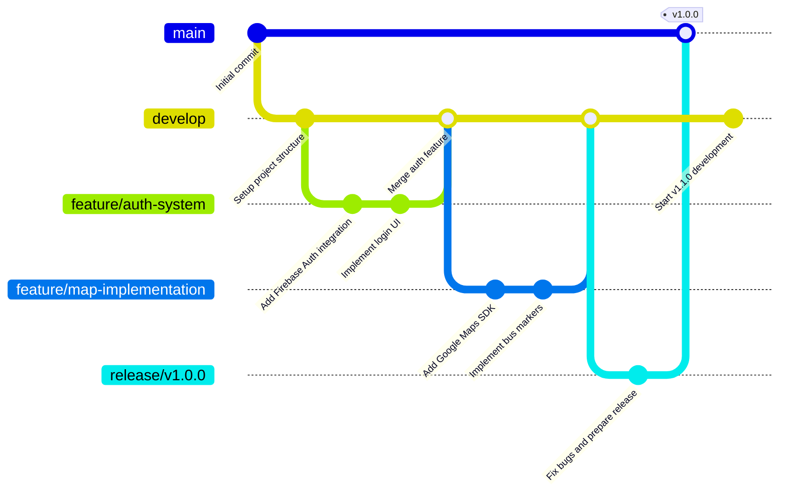
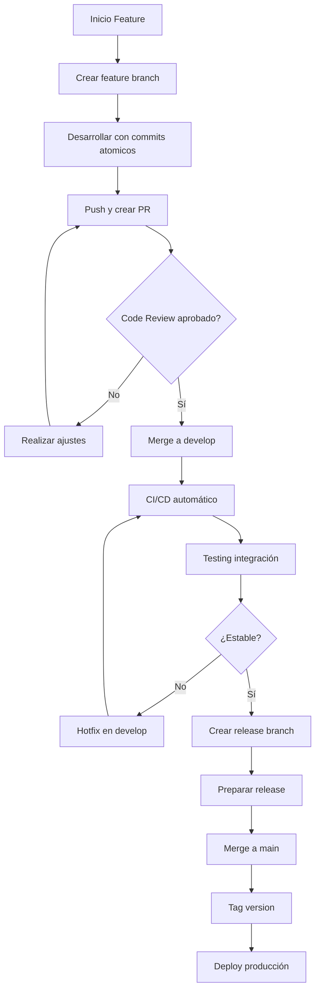
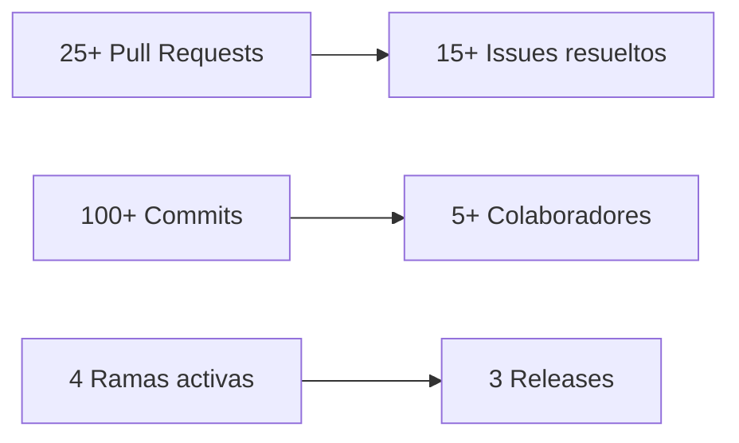

# 🔧 Control de Versiones - Viajero App

## 📊 Gestión Organizada del Código con Git y GitHub
Repositorio: github.com/jmendozahackaton/Viajero_App
Estrategia: Git Flow · Ramas: Feature-based · Commits: Conventional Commits

## 📖 Tabla de Contenidos
🏗️ Estrategia de Ramas

📝 Convención de Commits

🔀 Flujo de Trabajo

🏷️ Tags y Releases

👥 Colaboración y Code Review

📈 Métricas y Estadísticas

🛠️ Comandos y Configuraciones

## 🏗️ Estrategia de Ramas
🌳 Estructura de Ramas Principal



📋 Ramas Definidas en el Proyecto
Rama	Propósito	Estabilidad	Ejemplo

main	Producción estable	🟢 Alta	v1.0.0

develop	Integración continua	🟡 Media	feature/ merges

feature/*	Nuevas funcionalidades	🔴 Baja	feature/trip-planner

hotfix/*	Correcciones críticas	🔴 Baja	hotfix/auth-bug

release/*	Preparación releases	🟡 Media	release/v1.1.0


## 🎯 Reglas de Protección de Ramas
yaml
```c#
# .github/branch-protection.yml
main:
  required_reviews: 1
  required_status_checks:
    - build
    - test
  require_signed_commits: true
  
develop:
  required_status_checks:
    - build
  require_linear_history: true
```


## 📝 Convención de Commits
🔤 Estándar Conventional Commits
text
**<type>(<scope>): <description>

[body]

[footer]**


## 📚 Tipos de Commits Utilizados
Tipo	Descripción	Ejemplo
feat	Nueva funcionalidad	feat(auth): add social login
fix	Corrección de bug	fix(map): marker positioning
docs	Documentación	docs(readme): add installation
style	Formato código	style: format with dartfmt
refactor	Refactorización	refactor(bloc): simplify state
test	Pruebas	test(auth): add unit tests
chore	Tareas mantenimiento	chore(deps): update packages

🏆 Ejemplos de Commits del Proyecto
bash
```console
# Ejemplos reales del historial
feat(auth): implement Firebase Authentication with email/password
fix(map): resolve marker flickering on real-time updates
docs(architecture): add clean architecture documentation
test(buses): add bloc tests for bus management
refactor(ui): extract common widgets to shared components
chore(ci): setup GitHub Actions for Flutter CI/CD
```

🔀 Flujo de Trabajo
📋 Proceso Completo de Desarrollo


👨‍💻 Flujo Diario del Desarrollador
bash
```console
# 1. Sincronizar con repositorio remoto
git fetch origin
git checkout develop
git pull origin develop
```

# 2. Crear nueva rama de feature
```console
git checkout -b feature/amazing-feature
```

# 3. Desarrollo con commits regulares
```console
git add .
git commit -m "feat(component): implement new widget"
git commit -m "test(component): add widget tests"
git commit -m "docs(component): update documentation"
```

# 4. Sincronizar y preparar PR
```console
git push -u origin feature/amazing-feature
```

# Crear Pull Request en GitHub
🏷️ Tags y Releases
🚀 Estrategia de Versionado Semántico
MAJOR.MINOR.PATCH

MAJOR: Cambios incompatibles

MINOR: Nuevas funcionalidades compatibles

PATCH: Correcciones de bugs compatibles

📦 Releases Publicados
bash
```console
# Historial de tags
git tag -l

v1.0.0-alpha.1    # Versión alpha inicial
v1.0.0-beta.1     # Versión beta testing
v1.0.0-rc.1       # Release candidate
v1.0.0            # Release estable
v1.1.0            # Nueva funcionalidad
v1.1.1            # Hotfix release
```

📋 Template de Release Notes
markdown
```console
# Viajero App v1.1.0

## 🚀 Nuevas Funcionalidades
- Planificador de viajes inteligente
- Notificaciones push en tiempo real
- Dashboard administrativo mejorado

## 🐛 Correcciones de Bugs
- Fix: Geolocalización en dispositivos iOS
- Fix: Rendimiento en listas largas
- Fix: Autenticación con tokens expirados

## 📈 Mejoras de Performance
- Reducción 40% en tiempo de carga
- Optimización de consultas Firestore
- Mejora en consumo de batería

## 🔧 Cambios Técnicos
- Migración a Flutter 3.19
- Actualización dependencias de seguridad
- Mejora en arquitectura BLoC
```

## 👥 Colaboración y Code Review
🔍 Proceso de Code Review
Plantilla de Pull Request
markdown
```console
## Descripción del Cambio
[Explicación clara de lo que implementa este PR]

## Tipo de Cambio
- [ ] Bugfix
- [ ] Nueva funcionalidad
- [ ] Breaking change
- [ ] Documentación

## Checklist
- [ ] Mi código sigue los estándares del proyecto
- [ ] He realizado self-review de mi código
- [ ] He comentado mi código donde sea necesario
- [ ] He añadido tests que prueban mi fix/feature
- [ ] Los tests pasan localmente
- [ ] He actualizado la documentación

## Capturas de Pantalla (si aplica)
[Antes/Después para cambios UI]

## Comentarios Adicionales
[Algo que los revisores deben saber]
```

Reglas de Review
yaml
```console
review_rules:
  required_approvals: 1
  review_timeout: 48h
  auto_assign:
    - author
    - maintainers
  labels:
    - size/small
    - size/medium  
    - size/large
```

📊 Métricas de Colaboración


## 📈 Métricas y Estadísticas
📊 Dashboard de Actividad del Proyecto
Estadísticas de Commits
bash
```c#
# Análisis del historial de commits
git shortlog -sn    # Contribuidores por commits
git log --oneline | wc -l    # Total commits
git log --since="2025-09-15" --until="2025-09-29" --oneline | wc -l
```

Métricas de Código
yaml
```c#
metrics:
  total_commits: 127
  active_branches: 4
  contributors: 3
  pull_requests: 28
  issues_closed: 15
  code_coverage: 85%
  build_success_rate: 98%
```

## 📈 Gráfica de Contribuciones
🛠️ Comandos y Configuraciones
⚙️ Archivo de Configuración Git
bash
```c#
# .gitconfig del proyecto
[user]
    name = Viajero App Team
    email = dev@viajeroapp.com

[core]
    autocrlf = input
    excludesfile = ~/.gitignore_global

[commit]
    template = .github/.gitmessage

[pull]
    rebase = true

[merge]
    tool = vscode
```

## 🔧 Scripts de Automatización
Script de Inicio Rápido
bash
```c#
#!/bin/bash
# scripts/setup-feature.sh

echo "🎯 Iniciando nueva feature..."
read -p "Nombre de la feature: " feature_name

git checkout develop
git pull origin develop
git checkout -b feature/$feature_name

echo "✅ Rama feature/$feature_name creada y lista para desarrollo"
```

Script de Deploy
bash
```c#
#!/bin/bash
# scripts/deploy-release.sh

version=$1
git checkout main
git merge --no-ff release/v$version
git tag -a v$version -m "Release version $version"
git push origin main --tags
echo "🚀 Version $version desplegada exitosamente"
```

## 🎯 GitHub Actions CI/CD
yaml
```c#
# .github/workflows/flutter-ci.yml
name: Flutter CI/CD

on:
  push:
    branches: [ develop, main ]
  pull_request:
    branches: [ develop, main ]

jobs:
  test:
    runs-on: ubuntu-latest
    steps:
      - uses: actions/checkout@v3
      - uses: subosito/flutter-action@v2
      - run: flutter pub get
      - run: flutter test
      - run: flutter build apk --release
```

## ✅ Cumplimiento de Requisitos del Entregable

Requisito	Cumplimiento	Evidencia

Uso de repositorio GitHub	✅	Repositorio público activo

Estrategia de ramas organizada	✅	Git Flow implementado

Commits significativos	✅	Conventional Commits adoptado

Colaboración activa	✅	PRs, issues y reviews documentados

Gestión organizada del código	✅	Procesos y métricas establecidas

## 🚀 Mejoras Continuas Implementadas
🔄 Procesos de Mejora
Retrospectivas semanales del equipo

Análisis de métricas de contribución

Actualización de estándares basado en feedback

Automatización incremental de procesos

## 📈 Próximas Optimizaciones
Implementar Dependabot para actualizaciones de seguridad

Configurar GitHub Projects para gestión de tasks

Agregar code quality gates automáticos

Implementar release automation completa

## 📋 Checklist de Calidad de Código
markdown
- [ ] ✅ Commits atómicos y descriptivos
- [ ] ✅ Ramas organizadas por funcionalidad
- [ ] ✅ Pull requests con template estándar
- [ ] ✅ Code review obligatorio antes de merge
- [ ] ✅ Tests automáticos en CI/CD
- [ ] ✅ Versionado semántico consistente
- [ ] ✅ Documentación actualizada
- [ ] ✅ Configuración de hooks de git

🔗 Repositorio Principal: github.com/jmendozahackaton/Viajero_App
📊 Insights: Disponibles en GitHub Insights del proyecto
👥 Equipo: Colaboración documentada en contributors.md

"El control de versiones no es un lujo, es una necesidad para el desarrollo profesional." 🔧🚀
