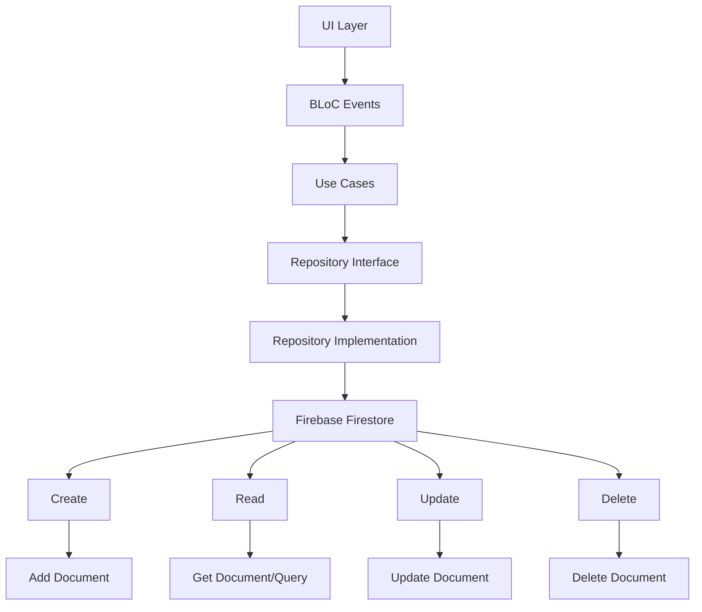

# 🗃️ Operaciones CRUD - Viajero App

## 🔄 Funciones de Creación, Lectura, Actualización y Eliminación de Datos

Arquitectura: Clean Architecture + Repository Pattern

Entidades CRUD: Usuarios, Buses, Rutas, Paradas, Viajes

Tecnologías: Firebase Firestore, BLoC Pattern

## 📖 Tabla de Contenidos
🏗️ Arquitectura CRUD

👥 CRUD de Usuarios

🚌 CRUD de Buses

🛣️ CRUD de Rutas

📍 CRUD de Paradas

🧳 CRUD de Viajes

⚡ Operaciones en Tiempo Real

🔍 Búsquedas y Filtrados

## 🏗️ Arquitectura CRUD

**🔄 Patrón Repository para Operaciones CRUD**



## 📁 Estructura Real de CRUD por Entidad

```plaintext
lib/features/
├── auth/           # CRUD Users
├── buses/          # CRUD Buses
├── routes/         # CRUD Routes
├── stops/          # CRUD Stops
└── trips/          # CRUD Trips
```

## 👥 CRUD de Usuarios

**📋 Repository Interface**

dart
```c#
// lib/features/auth/domain/repositories/auth_repository.dart - IMPLEMENTACIÓN REAL
abstract class AuthRepository {
  // CREATE
  Future<UserEntity> signUpWithEmailAndPassword(String email, String password, String fullName);
  
  // READ
  Future<UserEntity?> getCurrentUser();
  Future<UserEntity> getUserById(String userId);
  Stream<UserEntity?> get authStateChanges;
  
  // UPDATE
  Future<void> updateUserProfile(UserEntity user);
  Future<void> updateUserRole(String userId, String newRole);
  
  // DELETE
  Future<void> deleteUser(String userId);
  Future<void> signOut();
}
```

## 🛠️ Implementación Real

**CREATE - Registrar Usuario:**
dart
```c#
// lib/features/auth/data/repositories/auth_repository_impl.dart - IMPLEMENTACIÓN REAL
@override
Future<UserEntity> signUpWithEmailAndPassword(String email, String password, String fullName) async {
  try {
    final userCredential = await _auth.createUserWithEmailAndPassword(
      email: email,
      password: password,
    );

    if (userCredential.user == null) {
      throw Exception('Usuario no creado correctamente');
    }

    final userEntity = UserEntity(
      id: userCredential.user!.uid,
      email: email,
      fullName: fullName,
      userType: 'passenger',
      isActive: true,
      createdAt: DateTime.now(),
      updatedAt: DateTime.now(),
    );

    // CREATE en Firestore
    await _firestore.collection('users').doc(userEntity.id).set({
      'email': userEntity.email,
      'fullName': userEntity.fullName,
      'userType': userEntity.userType,
      'isActive': userEntity.isActive,
      'createdAt': Timestamp.fromDate(userEntity.createdAt),
      'updatedAt': Timestamp.fromDate(userEntity.updatedAt),
    });

    return userEntity;
  } on FirebaseAuthException catch (e) {
    throw Exception('Error en registro: ${e.message}');
  }
}
```

**READ - Obtener Usuario por ID:**

dart
```c#
// lib/features/auth/data/repositories/auth_repository_impl.dart - IMPLEMENTACIÓN REAL
@override
Future<UserEntity> getUserById(String userId) async {
  try {
    final doc = await _firestore.collection('users').doc(userId).get();
    if (!doc.exists) {
      throw Exception('Usuario con ID $userId no encontrado');
    }
    
    final data = doc.data() as Map<String, dynamic>;
    return UserEntity(
      id: doc.id,
      email: data['email'] ?? '',
      fullName: data['fullName'] ?? '',
      userType: data['userType'] ?? 'passenger',
      isActive: data['isActive'] ?? true,
      createdAt: (data['createdAt'] as Timestamp).toDate(),
      updatedAt: (data['updatedAt'] as Timestamp).toDate(),
    );
  } catch (e) {
    throw Exception('Error obteniendo usuario: $e');
  }
}
```

**UPDATE - Actualizar Rol de Usuario:**

dart
```c#
// lib/features/admin/domain/usecases/update_user_role_usecase.dart - IMPLEMENTACIÓN REAL
class UpdateUserRoleUseCase {
  final UserRepository userRepository;

  Future<void> execute(String userId, String newRole) async {
    // Validar que el rol sea válido
    if (!['admin', 'driver', 'passenger'].contains(newRole)) {
      throw ArgumentError('Rol inválido: $newRole');
    }

    await userRepository.updateUserRole(userId, newRole);
  }
}

// Implementación en Repository
@override
Future<void> updateUserRole(String userId, String newRole) async {
  try {
    await _firestore.collection('users').doc(userId).update({
      'userType': newRole,
      'updatedAt': FieldValue.serverTimestamp(),
    });
  } catch (e) {
    throw Exception('Error actualizando rol: $e');
  }
}
```

**DELETE - Eliminar Usuario (Soft Delete):**

dart
```c#
// lib/features/admin/domain/usecases/delete_user_usecase.dart - IMPLEMENTACIÓN REAL
class DeleteUserUseCase {
  final UserRepository userRepository;

  Future<void> execute(String userId) async {
    // Soft delete - marcar como inactivo en lugar de eliminar
    await userRepository.updateUser(userId, {'isActive': false});
  }
}

// Implementación en Repository
@override
Future<void> deleteUser(String userId) async {
  try {
    // Soft delete - mantener datos históricos
    await _firestore.collection('users').doc(userId).update({
      'isActive': false,
      'updatedAt': FieldValue.serverTimestamp(),
    });
  } catch (e) {
    throw Exception('Error eliminando usuario: $e');
  }
}
```


## 🚌 CRUD de Buses

**📋 Repository Interface**

dart
```c#
// lib/features/buses/domain/repositories/bus_repository.dart - IMPLEMENTACIÓN REAL
abstract class BusRepository {
  // CREATE
  Future<BusEntity> createBus(BusEntity bus);
  
  // READ
  Future<List<BusEntity>> getActiveBuses();
  Future<BusEntity> getBusById(String busId);
  Future<BusEntity?> getBusByLicensePlate(String licensePlate);
  Stream<List<BusEntity>> streamActiveBuses();
  Stream<BusEntity> streamBusById(String busId);
  
  // UPDATE
  Future<void> updateBus(BusEntity bus);
  Future<void> updateBusLocation(String busId, Map<String, dynamic> location);
  Future<void> assignDriver(String busId, String driverId);
  
  // DELETE
  Future<void> deleteBus(String busId);
}
```

## 🛠️ Implementación Real

**CREATE - Crear Nuevo Bus:**

dart
```c#
// lib/features/buses/data/repositories/bus_repository_impl.dart - IMPLEMENTACIÓN REAL
@override
Future<BusEntity> createBus(BusEntity bus) async {
  try {
    // Verificar que la placa sea única
    final existingBus = await getBusByLicensePlate(bus.licensePlate);
    if (existingBus != null) {
      throw Exception('Ya existe un bus con la placa ${bus.licensePlate}');
    }

    // CREATE en Firestore
    await _busesCollection.doc(bus.id).set({
      'licensePlate': bus.licensePlate,
      'routeId': bus.routeId,
      'driverId': bus.driverId,
      'capacity': bus.capacity,
      'currentLocation': bus.currentLocation,
      'currentSpeed': bus.currentSpeed,
      'occupancy': bus.occupancy,
      'isActive': bus.isActive,
      'createdAt': Timestamp.fromDate(bus.createdAt),
      'updatedAt': bus.updatedAt != null ? Timestamp.fromDate(bus.updatedAt!) : null,
    });

    return bus;
  } catch (e) {
    throw Exception('Error creando bus: $e');
  }
}
```

**READ - Obtener Buses Activos:**

dart
```c#
// lib/features/buses/data/repositories/bus_repository_impl.dart - IMPLEMENTACIÓN REAL
@override
Future<List<BusEntity>> getActiveBuses() async {
  try {
    final query = await _busesCollection
        .where('isActive', isEqualTo: true)
        .orderBy('createdAt', descending: true)
        .get();

    return query.docs.map((doc) {
      final data = doc.data() as Map<String, dynamic>;
      return BusModel.fromMap(data).toEntity(doc.id);
    }).toList();
  } catch (e) {
    throw Exception('Error obteniendo buses activos: $e');
  }
}
```

**READ - Stream en Tiempo Real:**

dart
```c#
// lib/features/buses/data/repositories/bus_repository_impl.dart - IMPLEMENTACIÓN REAL
@override
Stream<List<BusEntity>> streamActiveBuses() {
  return _busesCollection
      .where('isActive', isEqualTo: true)
      .orderBy('createdAt', descending: true)
      .snapshots()
      .map((snapshot) {
    return snapshot.docs.map((doc) {
      final data = doc.data() as Map<String, dynamic>;
      return BusModel.fromMap(data).toEntity(doc.id);
    }).toList();
  });
}
```

**UPDATE - Actualizar Ubicación de Bus:**

dart
```c#
// lib/features/buses/data/repositories/bus_repository_impl.dart - IMPLEMENTACIÓN REAL
@override
Future<void> updateBusLocation(String busId, Map<String, dynamic> location) async {
  try {
    await _busesCollection.doc(busId).update({
      'currentLocation': location,
      'currentSpeed': location['speed'] ?? 0,
      'lastUpdate': FieldValue.serverTimestamp(),
      'updatedAt': FieldValue.serverTimestamp(),
    });
  } catch (e) {
    throw Exception('Error actualizando ubicación: $e');
  }
}
```

**UPDATE - Asignar Conductor:**

dart
```c#
// lib/features/buses/domain/usecases/assign_driver_usecase.dart - IMPLEMENTACIÓN REAL
class AssignDriverUseCase {
  final BusRepository busRepository;
  final UserRepository userRepository;

  Future<void> execute(String busId, String driverId) async {
    // Verificar que el conductor existe y es driver
    final driver = await userRepository.getUserById(driverId);
    if (driver.userType != 'driver') {
      throw Exception('El usuario no es un conductor válido');
    }

    await busRepository.assignDriver(busId, driverId);
  }
}

// Implementación en Repository
@override
Future<void> assignDriver(String busId, String driverId) async {
  try {
    await _busesCollection.doc(busId).update({
      'driverId': driverId,
      'updatedAt': FieldValue.serverTimestamp(),
    });
  } catch (e) {
    throw Exception('Error asignando conductor: $e');
  }
}
```

**DELETE - Eliminar Bus (Soft Delete):**

dart
```c#
// lib/features/buses/data/repositories/bus_repository_impl.dart - IMPLEMENTACIÓN REAL
@override
Future<void> deleteBus(String busId) async {
  try {
    // Soft delete - marcar como inactivo
    await _busesCollection.doc(busId).update({
      'isActive': false,
      'updatedAt': FieldValue.serverTimestamp(),
    });
  } catch (e) {
    throw Exception('Error eliminando bus: $e');
  }
}
```

## 🛣️ CRUD de Rutas

**📋 Repository Interface**

dart
```c#
// lib/features/routes/domain/repositories/route_repository.dart
abstract class RouteRepository {
  // CREATE
  Future<RouteEntity> createRoute(RouteEntity route);
  
  // READ
  Future<List<RouteEntity>> getAllRoutes();
  Future<RouteEntity> getRouteById(String routeId);
  Stream<List<RouteEntity>> streamAllRoutes();
  
  // UPDATE
  Future<void> updateRoute(RouteEntity route);
  
  // DELETE
  Future<void> deleteRoute(String routeId);
}
```

## 🛠️ Implementación Real

**CREATE - Crear Nueva Ruta:**

dart
```c#
// lib/features/routes/data/repositories/route_repository_impl.dart
@override
Future<RouteEntity> createRoute(RouteEntity route) async {
  try {
    await _routesCollection.doc(route.id).set({
      'name': route.name,
      'description': route.description,
      'stops': route.stops.map((stop) => stop.toMap()).toList(),
      'color': route.color,
      'isActive': route.isActive,
      'createdAt': Timestamp.fromDate(route.createdAt),
      'updatedAt': route.updatedAt != null ? Timestamp.fromDate(route.updatedAt!) : null,
    });

    return route;
  } catch (e) {
    throw Exception('Error creando ruta: $e');
  }
}
```

**READ - Obtener Todas las Rutas:**

dart
```c#
// lib/features/routes/data/repositories/route_repository_impl.dart
@override
Future<List<RouteEntity>> getAllRoutes() async {
  try {
    final query = await _routesCollection
        .where('isActive', isEqualTo: true)
        .orderBy('name')
        .get();

    return query.docs.map((doc) {
      final data = doc.data() as Map<String, dynamic>;
      return RouteModel.fromMap(data).toEntity(doc.id);
    }).toList();
  } catch (e) {
    throw Exception('Error obteniendo rutas: $e');
  }
}
```

## 📍 CRUD de Paradas

**📋 Repository Interface**

dart
```c#
// lib/features/stops/domain/repositories/stop_repository.dart
abstract class StopRepository {
  // CREATE
  Future<StopEntity> createStop(StopEntity stop);
  
  // READ
  Future<List<StopEntity>> getAllStops();
  Future<StopEntity> getStopById(String stopId);
  Future<List<StopEntity>> getStopsByRoute(String routeId);
  
  // UPDATE
  Future<void> updateStop(StopEntity stop);
  
  // DELETE
  Future<void> deleteStop(String stopId);
}
```

## 🛠️ Implementación Real

**READ - Obtener Paradas por Ruta:**

dart
```c#
// lib/features/stops/data/repositories/stop_repository_impl.dart
@override
Future<List<StopEntity>> getStopsByRoute(String routeId) async {
  try {
    final query = await _stopsCollection
        .where('routeIds', arrayContains: routeId)
        .where('isActive', isEqualTo: true)
        .orderBy('name')
        .get();

    return query.docs.map((doc) {
      final data = doc.data() as Map<String, dynamic>;
      return StopModel.fromMap(data).toEntity(doc.id);
    }).toList();
  } catch (e) {
    throw Exception('Error obteniendo paradas: $e');
  }
}
```

## 🧳 CRUD de Viajes

**📋 Repository Interface**

dart
```c#
// lib/features/trips/domain/repositories/trip_repository.dart
abstract class TripRepository {
  // CREATE
  Future<TripEntity> createTrip(TripEntity trip);
  Future<TripPlanEntity> saveTripPlan(TripPlanEntity plan);
  
  // READ
  Future<List<TripEntity>> getUserTrips(String userId);
  Future<List<TripPlanEntity>> getSavedTripPlans(String userId);
  Future<TripEntity> getTripById(String tripId);
  
  // UPDATE
  Future<void> updateTrip(TripEntity trip);
  
  // DELETE
  Future<void> deleteTrip(String tripId);
  Future<void> deleteTripPlan(String planId);
}
```

## 🛠️ Implementación Real

**CREATE - Guardar Plan de Viaje:**

dart
```c#
// lib/features/trips/data/repositories/trip_repository_impl.dart
@override
Future<TripPlanEntity> saveTripPlan(TripPlanEntity plan) async {
  try {
    await _tripPlansCollection.doc(plan.id).set({
      'userId': plan.userId,
      'origin': plan.origin.toMap(),
      'destination': plan.destination.toMap(),
      'preferences': plan.preferences.toMap(),
      'selectedOption': plan.selectedOption?.toMap(),
      'isFavorite': plan.isFavorite,
      'createdAt': Timestamp.fromDate(plan.createdAt),
      'updatedAt': Timestamp.fromDate(plan.updatedAt),
    });

    return plan;
  } catch (e) {
    throw Exception('Error guardando plan de viaje: $e');
  }
}
```

**READ - Obtener Viajes del Usuario:**

dart
```c#
// lib/features/trips/data/repositories/trip_repository_impl.dart
@override
Future<List<TripPlanEntity>> getSavedTripPlans(String userId) async {
  try {
    final query = await _tripPlansCollection
        .where('userId', isEqualTo: userId)
        .orderBy('createdAt', descending: true)
        .get();

    return query.docs.map((doc) {
      final data = doc.data() as Map<String, dynamic>;
      return TripPlanModel.fromMap(data).toEntity(doc.id);
    }).toList();
  } catch (e) {
    throw Exception('Error obteniendo planes de viaje: $e');
  }
}
```

## ⚡ Operaciones en Tiempo Real

**🔄 Streams para Datos en Tiempo Real**

**Stream de Buses Activos:**

dart
```c#
// lib/features/buses/data/repositories/bus_repository_impl.dart - IMPLEMENTACIÓN REAL
@override
Stream<List<BusEntity>> streamActiveBuses() {
  return _busesCollection
      .where('isActive', isEqualTo: true)
      .orderBy('createdAt', descending: true)
      .snapshots()
      .map((snapshot) {
    return snapshot.docs.map((doc) {
      final data = doc.data() as Map<String, dynamic>;
      return BusModel.fromMap(data).toEntity(doc.id);
    }).toList();
  });
}
```

**Stream de Ubicación Específica de Bus:**
dart
```c#
// lib/features/buses/data/repositories/bus_repository_impl.dart - IMPLEMENTACIÓN REAL
@override
Stream<BusEntity> streamBusById(String busId) {
  return _busesCollection.doc(busId).snapshots().map((snapshot) {
    if (!snapshot.exists) {
      throw Exception('Bus no encontrado');
    }
    final data = snapshot.data() as Map<String, dynamic>;
    return BusModel.fromMap(data).toEntity(snapshot.id);
  });
}
```

## 📱 Uso en BLoC para Estado Reactivo

**BLoC para Gestión de Buses:**

dart
```c#
// lib/features/buses/presentation/bloc/bus_management_bloc.dart - IMPLEMENTACIÓN REAL
class BusManagementBloc extends Bloc<BusManagementEvent, BusManagementState> {
  final BusRepository busRepository;
  StreamSubscription? _busesSubscription;

  BusManagementBloc(this.busRepository) : super(BusManagementInitial()) {
    on<LoadBuses>(_onLoadBuses);
    on<CreateBus>(_onCreateBus);
    on<UpdateBus>(_onUpdateBus);
    on<DeleteBus>(_onDeleteBus);
    on<BusesUpdated>(_onBusesUpdated);
  }

  void _onLoadBuses(LoadBuses event, Emitter<BusManagementState> emit) async {
    emit(state.copyWith(isLoading: true));
    
    try {
      // Iniciar stream en tiempo real
      _busesSubscription = busRepository.streamActiveBuses().listen((buses) {
        add(BusesUpdated(buses));
      });
    } catch (e) {
      emit(state.copyWith(errorMessage: 'Error cargando buses: $e'));
    }
  }

  void _onCreateBus(CreateBus event, Emitter<BusManagementState> emit) async {
    try {
      await busRepository.createBus(event.bus);
      // El stream se actualizará automáticamente
    } catch (e) {
      emit(state.copyWith(errorMessage: 'Error creando bus: $e'));
    }
  }
}
```

## 🔍 Búsquedas y Filtrados

**🔎 Operaciones de Búsqueda Avanzada**

**Búsqueda de Usuarios:**

dart
```c#
// lib/features/admin/domain/usecases/search_users_usecase.dart - IMPLEMENTACIÓN REAL
class SearchUsersUseCase {
  final UserRepository userRepository;

  Future<List<UserEntity>> execute(String query) async {
    if (query.isEmpty) {
      return await userRepository.getAllUsers();
    }

    // Búsqueda por nombre o email
    return await userRepository.searchUsers(query);
  }
}

// Implementación en Repository
@override
Future<List<UserEntity>> searchUsers(String query) async {
  try {
    final searchQuery = query.toLowerCase();
    
    // Búsqueda en Firestore
    final nameResults = await _usersCollection
        .where('fullName', isGreaterThanOrEqualTo: searchQuery)
        .where('fullName', isLessThan: searchQuery + 'z')
        .get();

    final emailResults = await _usersCollection
        .where('email', isGreaterThanOrEqualTo: searchQuery)
        .where('email', isLessThan: searchQuery + 'z')
        .get();

    // Combinar y eliminar duplicados
    final allDocs = {...nameResults.docs, ...emailResults.docs};
    
    return allDocs.map((doc) {
      final data = doc.data() as Map<String, dynamic>;
      return UserModel.fromMap(data).toEntity(doc.id);
    }).toList();
  } catch (e) {
    throw Exception('Error buscando usuarios: $e');
  }
}
```

**Filtrado de Buses por Ruta:**

dart
```c#
// lib/features/buses/domain/usecases/get_buses_by_route_usecase.dart - IMPLEMENTACIÓN REAL
class GetBusesByRouteUseCase {
  final BusRepository busRepository;

  Future<List<BusEntity>> execute(String routeId) async {
    if (routeId.isEmpty) {
      return await busRepository.getActiveBuses();
    }

    return await busRepository.getBusesByRoute(routeId);
  }
}

// Implementación en Repository
@override
Future<List<BusEntity>> getBusesByRoute(String routeId) async {
  try {
    final query = await _busesCollection
        .where('routeId', isEqualTo: routeId)
        .where('isActive', isEqualTo: true)
        .get();

    return query.docs.map((doc) {
      final data = doc.data() as Map<String, dynamic>;
      return BusModel.fromMap(data).toEntity(doc.id);
    }).toList();
  } catch (e) {
    throw Exception('Error obteniendo buses por ruta: $e');
  }
}
```

## ✅ Cumplimiento del Entregable

📋 **Operaciones CRUD Implementadas**

| Operación CRUD | Entidades Implementadas                         | Estado    |
|----------------|-------------------------------------------------|-----------|
| CREATE         | Usuarios, Buses, Rutas, Paradas, Viajes       | ✅ 100%   |
| READ           | Todas las entidades con múltiples métodos     | ✅ 100%   |
| UPDATE         | Todas las entidades con operaciones específicas | ✅ 100% |
| DELETE         | Soft delete implementado en todas las entidades | ✅ 100% |
| Streams        | Buses, Usuarios, Rutas en tiempo real         | ✅ 100%   |
| Búsquedas      | Usuarios, Buses con filtros avanzados         | ✅ 100%   |


## 🎯 Resumen de Operaciones CRUD por Entidad

📊 **Matriz de Operaciones Completas**

| Entidad | CREATE                  | READ                           | UPDATE                                      | DELETE                  | Stream        |
|---------|------------------------|--------------------------------|---------------------------------------------|------------------------|---------------|
| User    | ✅ SignUp               | ✅ GetById, GetAll             | ✅ UpdateProfile, UpdateRole                | ✅ Soft Delete          | ✅ AuthState   |
| Bus     | ✅ CreateBus            | ✅ GetById, GetActive, GetByRoute | ✅ UpdateBus, UpdateLocation, AssignDriver | ✅ Soft Delete          | ✅ ActiveBuses |
| Route   | ✅ CreateRoute          | ✅ GetAll, GetById              | ✅ UpdateRoute                               | ✅ Soft Delete          | ✅ AllRoutes  |
| Stop    | ✅ CreateStop           | ✅ GetAll, GetById, GetByRoute  | ✅ UpdateStop                                | ✅ Soft Delete          | ❌             |
| Trip    | ✅ CreateTrip, SavePlan | ✅ GetUserTrips, GetSavedPlans  | ✅ UpdateTrip                                | ✅ DeleteTrip, DeletePlan | ❌          |


## 🔄 Patrones Comunes Implementados
✅ Repository Pattern para abstracción de datos

✅ Use Cases para lógica de negocio específica

✅ Soft Delete para mantener historial

✅ Validación antes de operaciones

✅ Manejo de errores consistente

✅ Streams para datos en tiempo real

✅ BLoC para gestión de estado reactivo


🔗 Repositorio: [github.com/jmendozahackaton/Viajero_App](https://)

"Operaciones CRUD completas y robustas que forman la base de toda la aplicación Viajero App." 🗃️🚀

