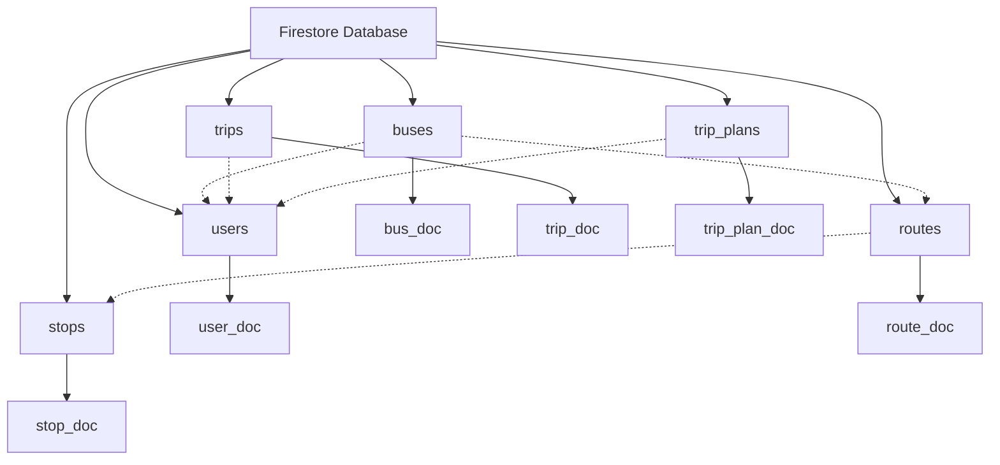
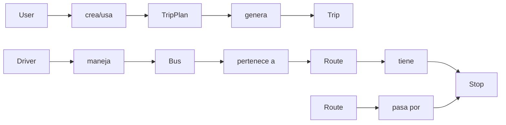

# 🗃️ Modelado de Base de Datos - Viajero App

## 🔥 Esquema Estructurado en Firebase Firestore

Base de Datos: Firebase Firestore (NoSQL)
Enfoque: Colecciones y Documentos con relaciones
Características: Tiempo real, escalable, seguro

## 📖 Tabla de Contenidos

🏗️ Arquitectura General de la Base de Datos

👥 Colección: Users

🚌 Colección: Buses

🛣️ Colección: Routes

📍 Colección: Stops

🧳 Colección: Trips & TripPlans

🔗 Relaciones y Consultas

🛡️ Reglas de Seguridad

📊 Índices y Optimizaciones


## 🏗️ Arquitectura General de la Base de Datos

**🔄 Estructura de Colecciones**



## 📋 Resumen de Colecciones

📋 **Colecciones en Firebase Firestore**


| Colección    | Documentos  | Descripción                                  |
|--------------|------------|----------------------------------------------|
| users        | ~1,000+    | Usuarios del sistema (admin, driver, passenger) |
| buses        | ~50-100    | Flota de buses con ubicación en tiempo real |
| routes       | ~15-20     | Rutas del transporte público                 |
| stops        | ~200-300   | Paradas de buses georreferenciadas          |
| trips        | ~5,000+    | Historial de viajes realizados              |
| trip_plans   | ~2,000+    | Planes de viaje guardados por usuarios      |


## 👥 Colección: Users

**📄 Estructura del Documento User**

javascript
```json
// users/{userId}
{
  // Identificación
  "id": "user_001",
  "email": "usuario@ejemplo.com",
  "fullName": "Juan Pérez García",
  
  // Roles y permisos
  "userType": "passenger", // ['admin', 'driver', 'passenger']
  "isActive": true,
  
  // Información adicional para conductores
  "licenseNumber": "LN123456",        // Solo para drivers
  "licenseExpiry": "2025-12-31",      // Solo para drivers
  "assignedRoutes": ["route_101"],    // Solo para drivers
  
  // Información de contacto
  "phoneNumber": "+505 8888 8888",
  
  // Dispositivos y notificaciones
  "deviceTokens": ["token1", "token2"],
  
  // Metadata
  "createdAt": "2024-01-15T10:30:00Z",
  "updatedAt": "2024-01-20T14:25:00Z",
  "lastLogin": "2024-01-20T14:25:00Z"
}
```

## 🔍 Campos Clave y Tipos

📋 **Estructura de Documento: Users**


| Campo           | Tipo       | Requerido | Descripción                                 |
|-----------------|-----------|-----------|--------------------------------------------|
| id              | string    | ✅        | ID único del usuario (mismo que Auth UID) |
| email           | string    | ✅        | Email único para login                      |
| fullName        | string    | ✅        | Nombre completo del usuario                 |
| userType        | string    | ✅        | Rol: 'admin', 'driver', 'passenger'       |
| isActive        | boolean   | ✅        | Si el usuario está activo en el sistema    |
| licenseNumber   | string    | ❌        | Número de licencia (solo drivers)          |
| assignedRoutes  | array     | ❌        | Rutas asignadas (solo drivers)             |
| deviceTokens    | array     | ❌        | Tokens para notificaciones push            |
| createdAt       | timestamp | ✅        | Fecha de creación                           |
| updatedAt       | timestamp | ✅        | Última actualización                        |


**🎯 Consultas Comunes**
javascript
```json
// Obtener usuario por email
db.collection('users').where('email', '==', 'usuario@ejemplo.com')

// Obtener todos los conductores activos
db.collection('users')
  .where('userType', '==', 'driver')
  .where('isActive', '==', true)

// Obtener usuarios por rol
db.collection('users')
  .where('userType', 'in', ['admin', 'driver'])
  .orderBy('fullName')
```

## 🚌 Colección: Buses

**📄 Estructura del Documento Bus**

javascript
```json
// buses/{busId}
{
  // Identificación
  "id": "bus_001",
  "licensePlate": "ABC-123",
  
  // Información operativa
  "routeId": "route_101",
  "driverId": "user_456",           // Referencia a users collection
  "capacity": 50,
  "occupancy": 35,
  
  // Ubicación en tiempo real
  "currentLocation": {
    "latitude": 12.136389,
    "longitude": -86.251389,
    "address": "Managua, Nicaragua"
  },
  "currentSpeed": 45,               // km/h
  "lastUpdate": "2024-01-20T14:30:00Z",
  
  // Estado del bus
  "isActive": true,
  "status": "in_route",            // ['in_route', 'stopped', 'maintenance']
  
  // Información de la ruta actual
  "currentStopIndex": 5,
  "nextStop": "stop_023",
  "estimatedArrival": 8,           // minutos para próxima parada
  
  // Metadata
  "createdAt": "2024-01-10T08:00:00Z",
  "updatedAt": "2024-01-20T14:30:00Z"
}
```

🔍 **Campos Clave y Tipos: Buses**

| Campo           | Tipo       | Requerido | Descripción                                  |
|-----------------|-----------|-----------|---------------------------------------------|
| id              | string    | ✅        | ID único del bus                             |
| licensePlate    | string    | ✅        | Placa única del bus                           |
| routeId         | string    | ✅        | Referencia a la ruta asignada                |
| driverId        | string    | ❌        | Referencia al conductor asignado             |
| currentLocation | map       | ✅        | Ubicación GPS en tiempo real                 |
| currentSpeed    | number    | ✅        | Velocidad actual en km/h                     |
| isActive        | boolean   | ✅        | Si el bus está en operación                  |
| capacity        | number    | ✅        | Capacidad máxima de pasajeros               |
| occupancy       | number    | ✅        | Pasajeros actuales a bordo                   |
| lastUpdate      | timestamp | ✅        | Última actualización de ubicación           |


**🎯 Consultas Comunes**
javascript
```c#
// Obtener buses activos en una ruta específica
db.collection('buses')
  .where('routeId', '==', 'route_101')
  .where('isActive', '==', true)

// Obtener buses cerca de una ubicación (usando geoqueries)
db.collection('buses')
  .where('isActive', '==', true)
  .where('currentLocation.latitude', '>=', minLat)
  .where('currentLocation.latitude', '<=', maxLat)
  .where('currentLocation.longitude', '>=', minLng)
  .where('currentLocation.longitude', '<=', maxLng)

// Stream de buses activos en tiempo real
db.collection('buses')
  .where('isActive', '==', true)
  .orderBy('lastUpdate', 'desc')
```

## 🛣️ Colección: Routes

**📄 Estructura del Documento Route**

javascript
```json
// routes/{routeId}
{
  // Identificación
  "id": "route_101",
  "name": "Ruta 101 - Mercado Oriental - UCA",
  "description": "Conecta el Mercado Oriental con la UCA pasando por el Centro",
  
  // Información de la ruta
  "color": "#FF6B35",              // Color para representación en mapa
  "distance": 12.5,                // km
  "estimatedTime": 45,             // minutos
  "fare": 10,                      // C$ tarifa
  
  // Paradas de la ruta (ordenadas)
  "stops": [
    {
      "stopId": "stop_001",
      "name": "Mercado Oriental - Entrada Principal",
      "order": 1,
      "estimatedTime": 0
    },
    {
      "stopId": "stop_002", 
      "name": "Parque Central",
      "order": 2,
      "estimatedTime": 8
    }
    // ... más paradas
  ],
  
  // Horarios de operación
  "schedule": {
    "weekdays": {
      "start": "05:00",
      "end": "22:00",
      "frequency": 15              // minutos entre buses
    },
    "weekends": {
      "start": "06:00", 
      "end": "21:00",
      "frequency": 20
    }
  },
  
  // Estadísticas
  "averageOccupancy": 65,          // %
  "onTimePerformance": 87,         // %
  
  // Estado
  "isActive": true,
  
  // Metadata
  "createdAt": "2024-01-01T00:00:00Z",
  "updatedAt": "2024-01-15T09:30:00Z"
}
```

🔍 **Campos Clave y Tipos: Routes**

| Campo    | Tipo    | Requerido | Descripción                        |
|----------|--------|-----------|------------------------------------|
| id       | string | ✅        | ID único de la ruta                 |
| name     | string | ✅        | Nombre descriptivo de la ruta      |
| color    | string | ✅        | Color hexadecimal para el mapa     |
| stops    | array  | ✅        | Lista ordenada de paradas          |
| schedule | map    | ✅        | Horarios de operación               |
| distance | number | ✅        | Distancia total en km              |
| fare     | number | ✅        | Tarifa en córdobas                 |
| isActive | boolean| ✅        | Si la ruta está activa             |


## 📍 Colección: Stops

**📄 Estructura del Documento Stop**

javascript
```json
// stops/{stopId}
{
  // Identificación
  "id": "stop_001", 
  "name": "Mercado Oriental - Entrada Principal",
  "description": "Parada principal frente al Mercado Oriental",
  
  // Ubicación geográfica
  "location": {
    "latitude": 12.136389,
    "longitude": -86.251389,
    "address": "Mercado Oriental, Managua",
    "zone": "Centro"               // Zona de la ciudad
  },
  
  // Información de la parada
  "type": "main",                  // ['main', 'secondary', 'express']
  "amenities": ["shelter", "seating", "lighting"],
  
  // Rutas que pasan por esta parada
  "routeIds": ["route_101", "route_102", "route_115"],
  
  // Tiempos promedio de espera
  "averageWaitTime": 8,            // minutos
  "peakWaitTime": 15,              // minutos en hora pico
  
  // Estado
  "isActive": true,
  
  // Metadata
  "createdAt": "2024-01-01T00:00:00Z",
  "updatedAt": "2024-01-10T14:20:00Z"
}
```

🔍 **Campos Clave y Tipos: Stops**

| Campo     | Tipo    | Requerido | Descripción                          |
|-----------|--------|-----------|--------------------------------------|
| id        | string | ✅        | ID único de la parada                 |
| name      | string | ✅        | Nombre descriptivo de la parada      |
| location  | map    | ✅        | Coordenadas GPS y dirección           |
| routeIds  | array  | ✅        | Rutas que pasan por esta parada      |
| type      | string | ✅        | Tipo de parada                        |
| isActive  | boolean| ✅        | Si la parada está activa              |


## 🧳 Colección: Trips & TripPlans

**📄 Estructura del Documento TripPlan**

javascript
```json
// trip_plans/{planId}
{
  // Identificación
  "id": "plan_001",
  "userId": "user_123",            // Referencia a users collection
  
  // Origen y destino
  "origin": {
    "name": "UCA - Universidad Centroamericana",
    "location": {
      "latitude": 12.126634,
      "longitude": -86.270623
    },
    "stopId": "stop_015"           // Parada más cercana
  },
  
  "destination": {
    "name": "Metrocentro",
    "location": {
      "latitude": 12.132456, 
      "longitude": -86.265432
    },
    "stopId": "stop_023"
  },
  
  // Preferencias del usuario
  "preferences": {
    "maxWalkingDistance": 500,     // metros
    "maxTransfers": 2,
    "optimizeFor": "time"          // ['time', 'cost', 'comfort']
  },
  
  // Opciones generadas
  "options": [
    {
      "routeId": "route_101",
      "totalTime": 25,
      "walkingDistance": 350,
      "cost": 10,
      "transfers": 0
    }
  ],
  
  // Opción seleccionada
  "selectedOption": 0,
  
  // Metadata
  "isFavorite": false,
  "createdAt": "2024-01-20T10:15:00Z",
  "updatedAt": "2024-01-20T10:15:00Z"
}
```

**📄 Estructura del Documento Trip**

javascript
```json
// trips/{tripId}
{
  // Identificación
  "id": "trip_001", 
  "userId": "user_123",
  "tripPlanId": "plan_001",        // Referencia al plan usado
  
  // Información del viaje
  "origin": {
    "name": "UCA - Universidad Centroamericana",
    "location": { /* ... */ }
  },
  "destination": {
    "name": "Metrocentro", 
    "location": { /* ... */ }
  },
  
  // Ruta tomada
  "routeId": "route_101",
  "busId": "bus_015",
  
  // Tiempos y métricas
  "startTime": "2024-01-20T10:30:00Z",
  "endTime": "2024-01-20T10:55:00Z", 
  "actualDuration": 25,             // minutos
  "estimatedDuration": 23,          // minutos
  
  // Feedback del usuario
  "rating": 4,                      // 1-5 estrellas
  "comments": "Viaje cómodo y puntual",
  
  // Metadata
  "createdAt": "2024-01-20T10:55:00Z"
}
```

## 🔗 Relaciones y Consultas

**🔄 Relaciones entre Colecciones**



## 🎯 Consultas Complejas Implementadas

**Buses Activos con Información de Conductor:**

javascript
```c#
// Obtener buses activos con datos del conductor
const busesSnapshot = await db.collection('buses')
  .where('isActive', '==', true)
  .get();

// Obtener información de conductores en paralelo
const driverPromises = busesSnapshot.docs.map(async (busDoc) => {
  const busData = busDoc.data();
  if (busData.driverId) {
    const driverDoc = await db.collection('users').doc(busData.driverId).get();
    return {
      ...busData,
      driver: driverDoc.exists ? driverDoc.data() : null
    };
  }
  return busData;
});
```

**Paradas Cercanas a una Ubicación:**

javascript
```c#
// Encontrar paradas dentro de un radio de 500m
async function findNearbyStops(userLat, userLng, radiusMeters = 500) {
  const earthRadiusKm = 6371;
  const latDelta = radiusMeters / 1000 / earthRadiusKm * (180 / Math.PI);
  const lngDelta = latDelta / Math.cos(userLat * Math.PI / 180);
  
  const stopsSnapshot = await db.collection('stops')
    .where('location.latitude', '>=', userLat - latDelta)
    .where('location.latitude', '<=', userLat + latDelta)
    .where('location.longitude', '>=', userLng - lngDelta)
    .where('location.longitude', '<=', userLng + lngDelta)
    .where('isActive', '==', true)
    .get();
    
  // Filtrar por distancia exacta usando Haversine
  return stopsSnapshot.docs.filter(doc => {
    const stop = doc.data();
    const distance = calculateDistance(
      userLat, userLng,
      stop.location.latitude, stop.location.longitude
    );
    return distance <= radiusMeters;
  });
}
```

## 🛡️ Reglas de Seguridad

**🔐 Firebase Security Rules**

javascript
```c#
// firestore.rules - IMPLEMENTACIÓN REAL
rules_version = '2';
service cloud.firestore {
  match /databases/{database}/documents {
    // Reglas para usuarios
    match /users/{userId} {
      allow read, write: if request.auth != null && 
        (request.auth.uid == userId || 
         get(/databases/$(database)/documents/users/$(request.auth.uid)).data.userType == 'admin');
      allow create: if request.auth != null && 
        request.auth.uid == userId;
    }
    
    // Reglas para buses
    match /buses/{busId} {
      allow read: if request.auth != null;
      allow write: if request.auth != null && 
        get(/databases/$(database)/documents/users/$(request.auth.uid)).data.userType == 'admin';
    }
    
    // Reglas para rutas
    match /routes/{routeId} {
      allow read: if request.auth != null;
      allow write: if request.auth != null && 
        get(/databases/$(database)/documents/users/$(request.auth.uid)).data.userType == 'admin';
    }
    
    // Reglas para paradas
    match /stops/{stopId} {
      allow read: if request.auth != null;
      allow write: if request.auth != null && 
        get(/databases/$(database)/documents/users/$(request.auth.uid)).data.userType == 'admin';
    }
    
    // Reglas para planes de viaje
    match /trip_plans/{planId} {
      allow read, write: if request.auth != null && 
        request.auth.uid == resource.data.userId;
      allow create: if request.auth != null && 
        request.auth.uid == request.resource.data.userId;
    }
    
    // Reglas para viajes
    match /trips/{tripId} {
      allow read, write: if request.auth != null && 
        request.auth.uid == resource.data.userId;
    }
  }
}
```

## 📊 Índices y Optimizaciones

**🚀 Índices Compuestos Configurados**

**Para consultas de buses:**

json
```json
{
  "collectionGroup": "buses",
  "queryScope": "COLLECTION",
  "fields": [
    { "fieldPath": "isActive", "order": "ASCENDING" },
    { "fieldPath": "routeId", "order": "ASCENDING" },
    { "fieldPath": "lastUpdate", "order": "DESCENDING" }
  ]
}
```

**Para consultas de usuarios:**

json
```json
{
  "collectionGroup": "users", 
  "queryScope": "COLLECTION",
  "fields": [
    { "fieldPath": "userType", "order": "ASCENDING" },
    { "fieldPath": "isActive", "order": "ASCENDING" },
    { "fieldPath": "fullName", "order": "ASCENDING" }
  ]
}
```

**Para consultas de paradas por ubicación:**

json
```json
{
  "collectionGroup": "stops",
  "queryScope": "COLLECTION", 
  "fields": [
    { "fieldPath": "isActive", "order": "ASCENDING" },
    { "fieldPath": "location.latitude", "order": "ASCENDING" },
    { "fieldPath": "location.longitude", "order": "ASCENDING" }
  ]
}
```

## ⚡ Estrategias de Optimización

✅ Denormalización controlada para datos frecuentes

✅ Índices compuestos para consultas comunes

✅ Paginación para listas grandes

✅ Streams para datos en tiempo real

✅ Validación en reglas de seguridad

✅ Estructura plana para mejor rendimiento

✅ Resumen del Modelado


## 🎯 **Características del Esquema**

| Aspecto        | Implementación                                 |
|----------------|-----------------------------------------------|
| Estructura     | Colecciones y documentos NoSQL                |
| Relaciones     | Referencias por ID + denormalización         |
| Escalabilidad  | Diseñado para crecimiento horizontal         |
| Seguridad      | Reglas por rol y propiedad                    |
| Performance    | Índices optimizados para consultas comunes   |
| Tiempo Real    | Streams para datos dinámicos                  |


## 📈 **Métricas de la Base de Datos**

| Colección   | Documentos Estimados | Tamaño Promedio | Crecimiento |
|------------|--------------------|----------------|------------|
| users      | 1,000+             | 2KB            | Bajo       |
| buses      | 50-100             | 1KB            | Estable    |
| routes     | 15-20              | 5KB            | Muy bajo   |
| stops      | 200-300            | 2KB            | Bajo       |
| trips      | 5,000+             | 3KB            | Alto       |
| trip_plans | 2,000+             | 4KB            | Medio      |


🔗 Repositorio: [github.com/jmendozahackaton/Viajero_App](https://)

"Esquema de base de datos optimizado para las necesidades específicas del transporte público en Nicaragua." 🗃️

