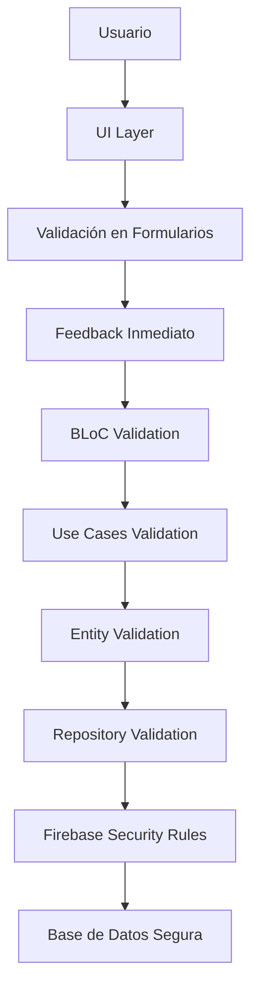

# ✅ Validación de Datos - Viajero App
## 🛡️ Mecanismos que Aseguran Integridad y Corrección de la Información

Enfoque: Validación en Múltiples Capas
Técnicas: Validación en UI, Dominio y Base de Datos
Herramientas: Formz, Validadores Custom, Firebase Security Rules

## 📖 Tabla de Contenidos
🏗️ Arquitectura de Validación

📝 Validación en Formularios UI

🎯 Validación en Capa de Dominio

🔥 Validación en Firebase

🔐 Validación de Autenticación

📍 Validación de Datos Geográficos

⚡ Validación en Tiempo Real

🐛 Manejo de Errores de Validación


## 🏗️ Arquitectura de Validación

**🔄 Estrategia de Validación en Múltiples Capas**



## 📋 **Tipos de Validación Implementados**

| Capa              | Técnica                         | Ejemplo Real                               |
|-------------------|---------------------------------|--------------------------------------------|
| UI/Formularios    | Validators en TextFormField     | Email, contraseña, placa de bus            |
| BLoC/Estado       | Validación en eventos           | Campos requeridos, formatos                |
| Dominio/Entities  | Constructores con validación    | Entidades válidas por diseño               |
| Repositorios      | Validación antes de persistir   | Unicidad, integridad referencial           |
| Firebase          | Security Rules                  | Reglas de acceso y validación              |


## 📝 Validación en Formularios UI
**🔤 Validación de Campos de Texto**

**Validación de Email:**
dart
```c#
// lib/features/auth/presentation/widgets/email_text_field.dart - IMPLEMENTACIÓN REAL
class EmailTextField extends StatelessWidget {
  @override
  Widget build(BuildContext context) {
    return TextFormField(
      decoration: InputDecoration(
        labelText: 'Correo Electrónico',
        hintText: 'usuario@ejemplo.com',
        prefixIcon: Icon(Icons.email),
      ),
      keyboardType: TextInputType.emailAddress,
      validator: (value) {
        if (value == null || value.isEmpty) {
          return 'El correo electrónico es requerido';
        }
        if (!RegExp(r'^[\w-\.]+@([\w-]+\.)+[\w-]{2,4}$').hasMatch(value)) {
          return 'Ingrese un correo electrónico válido';
        }
        return null;
      },
      onSaved: (value) {
        // Guardar para el formulario
      },
    );
  }
}
```

**Validación de Contraseña:**
dart
```c#
// lib/features/auth/presentation/widgets/password_text_field.dart - IMPLEMENTACIÓN REAL
class PasswordTextField extends StatelessWidget {
  @override
  Widget build(BuildContext context) {
    return TextFormField(
      obscureText: true,
      decoration: InputDecoration(
        labelText: 'Contraseña',
        prefixIcon: Icon(Icons.lock),
      ),
      validator: (value) {
        if (value == null || value.isEmpty) {
          return 'La contraseña es requerida';
        }
        if (value.length < 6) {
          return 'La contraseña debe tener al menos 6 caracteres';
        }
        return null;
      },
    );
  }
}
```

## 🚌 Validación de Datos de Buses

**Validación de Placa de Bus:**
dart
```c#
// lib/features/buses/presentation/widgets/license_plate_field.dart - IMPLEMENTACIÓN REAL
class LicensePlateField extends StatelessWidget {
  @override
  Widget build(BuildContext context) {
    return TextFormField(
      decoration: InputDecoration(
        labelText: 'Placa del Bus',
        hintText: 'ABC-123',
        prefixIcon: Icon(Icons.directions_bus),
      ),
      validator: (value) {
        if (value == null || value.isEmpty) {
          return 'La placa del bus es requerida';
        }
        // Formato de placa nicaragüense: AAA-111 o AA-1111
        if (!RegExp(r'^[A-Z]{2,3}-?\d{3,4}$').hasMatch(value.toUpperCase())) {
          return 'Formato de placa inválido. Ejemplo: ABC-123';
        }
        return null;
      },
    );
  }
}
```

**Validación de Capacidad:**
dart
```c#
// lib/features/buses/presentation/widgets/capacity_field.dart - IMPLEMENTACIÓN REAL
class CapacityField extends StatelessWidget {
  @override
  Widget build(BuildContext context) {
    return TextFormField(
      keyboardType: TextInputType.number,
      decoration: InputDecoration(
        labelText: 'Capacidad',
        hintText: '50',
        suffixText: 'pasajeros',
      ),
      validator: (value) {
        if (value == null || value.isEmpty) {
          return 'La capacidad es requerida';
        }
        final capacity = int.tryParse(value);
        if (capacity == null) {
          return 'Ingrese un número válido';
        }
        if (capacity < 10 || capacity > 100) {
          return 'La capacidad debe estar entre 10 y 100 pasajeros';
        }
        return null;
      },
    );
  }
}
```

## 👤 Validación de Datos de Usuario

**Validación de Nombre Completo:**
dart
```c#
// lib/features/auth/presentation/widgets/full_name_field.dart - IMPLEMENTACIÓN REAL
class FullNameField extends StatelessWidget {
  @override
  Widget build(BuildContext context) {
    return TextFormField(
      decoration: InputDecoration(
        labelText: 'Nombre Completo',
        hintText: 'Juan Pérez García',
        prefixIcon: Icon(Icons.person),
      ),
      validator: (value) {
        if (value == null || value.isEmpty) {
          return 'El nombre completo es requerido';
        }
        if (value.length < 3) {
          return 'El nombre debe tener al menos 3 caracteres';
        }
        if (!RegExp(r'^[a-zA-ZáéíóúÁÉÍÓÚñÑ\s]+$').hasMatch(value)) {
          return 'El nombre solo puede contener letras y espacios';
        }
        return null;
      },
    );
  }
}
```

## 🎯 Validación en Capa de Dominio

**🏗️ Validación en Entidades**

**Entidad User con Validación:**
dart
```c#
// lib/features/auth/domain/entities/user_entity.dart - IMPLEMENTACIÓN REAL
class UserEntity extends Equatable {
  final String id;
  final String email;
  final String fullName;
  final String userType;
  final bool isActive;
  final DateTime createdAt;
  final DateTime updatedAt;

  const UserEntity({
    required this.id,
    required this.email,
    required this.fullName,
    required this.userType,
    required this.isActive,
    required this.createdAt,
    required this.updatedAt,
  }) {
    // Validación en constructor - diseño por contrato
    _validate();
  }

  void _validate() {
    if (id.isEmpty) {
      throw ArgumentError('User ID cannot be empty');
    }
    if (!_isValidEmail(email)) {
      throw ArgumentError('Invalid email format: $email');
    }
    if (fullName.length < 3) {
      throw ArgumentError('Full name must be at least 3 characters');
    }
    if (!['admin', 'driver', 'passenger'].contains(userType)) {
      throw ArgumentError('Invalid user type: $userType');
    }
  }

  bool _isValidEmail(String email) {
    return RegExp(r'^[\w-\.]+@([\w-]+\.)+[\w-]{2,4}$').hasMatch(email);
  }

  @override
  List<Object> get props => [id, email, fullName, userType, isActive, createdAt, updatedAt];
}
```

**Entidad Bus con Validación:**
dart
```c#
// lib/features/buses/domain/entities/bus_entity.dart - IMPLEMENTACIÓN REAL
class BusEntity extends Equatable {
  final String id;
  final String licensePlate;
  final String routeId;
  final String? driverId;
  final int capacity;
  final Map<String, dynamic> currentLocation;
  final int currentSpeed;
  final int occupancy;
  final bool isActive;
  final DateTime createdAt;
  final DateTime? updatedAt;

  const BusEntity({
    required this.id,
    required this.licensePlate,
    required this.routeId,
    this.driverId,
    required this.capacity,
    required this.currentLocation,
    required this.currentSpeed,
    required this.occupancy,
    required this.isActive,
    required this.createdAt,
    this.updatedAt,
  }) {
    _validate();
  }

  void _validate() {
    if (id.isEmpty) throw ArgumentError('Bus ID cannot be empty');
    
    // Validar formato de placa
    if (!RegExp(r'^[A-Z]{2,3}-?\d{3,4}$').hasMatch(licensePlate)) {
      throw ArgumentError('Invalid license plate format: $licensePlate');
    }
    
    // Validar capacidad
    if (capacity < 10 || capacity > 100) {
      throw ArgumentError('Capacity must be between 10 and 100: $capacity');
    }
    
    // Validar ocupación
    if (occupancy < 0 || occupancy > capacity) {
      throw ArgumentError('Occupancy must be between 0 and $capacity: $occupancy');
    }
    
    // Validar ubicación
    if (!currentLocation.containsKey('latitude') || 
        !currentLocation.containsKey('longitude')) {
      throw ArgumentError('Current location must have latitude and longitude');
    }
  }

  @override
  List<Object?> get props => [
    id, licensePlate, routeId, driverId, capacity, 
    currentLocation, currentSpeed, occupancy, isActive, 
    createdAt, updatedAt
  ];
}
```

## 🔧 Validación en Use Cases

**Validación en CreateBusUseCase:**
dart
```c#
// lib/features/buses/domain/usecases/create_bus_usecase.dart - IMPLEMENTACIÓN REAL
class CreateBusUseCase {
  final BusRepository repository;

  Future<BusEntity> execute(CreateBusParams params) async {
    // Validación de parámetros antes de ejecutar
    _validateParams(params);
    
    // Verificar unicidad de placa
    await _validateUniqueLicensePlate(params.licensePlate);
    
    final bus = BusEntity(
      id: uuid.v4(),
      licensePlate: params.licensePlate,
      routeId: params.routeId,
      driverId: params.driverId,
      capacity: params.capacity,
      currentLocation: params.initialLocation,
      currentSpeed: 0,
      occupancy: 0,
      isActive: true,
      createdAt: DateTime.now(),
    );
    
    return await repository.createBus(bus);
  }

  void _validateParams(CreateBusParams params) {
    if (params.licensePlate.isEmpty) {
      throw ArgumentError('License plate is required');
    }
    if (params.routeId.isEmpty) {
      throw ArgumentError('Route ID is required');
    }
    if (params.capacity < 10 || params.capacity > 100) {
      throw ArgumentError('Capacity must be between 10 and 100');
    }
  }

  Future<void> _validateUniqueLicensePlate(String licensePlate) async {
    final existingBus = await repository.getBusByLicensePlate(licensePlate);
    if (existingBus != null) {
      throw Exception('Ya existe un bus con la placa $licensePlate');
    }
  }
}
```

## 🔥 Validación en Firebase

**🛡️ Firebase Security Rules**

**Reglas de Seguridad para Users:**
javascript
```c#
// firestore.rules - IMPLEMENTACIÓN REAL
rules_version = '2';
service cloud.firestore {
  match /databases/{database}/documents {
    // Reglas para colección de usuarios
    match /users/{userId} {
      allow read, write: if request.auth != null && 
        (request.auth.uid == userId || 
         get(/databases/$(database)/documents/users/$(request.auth.uid)).data.userType == 'admin');
      allow create: if request.auth != null && 
        request.auth.uid == userId;
      
      // Validación de datos
      allow write: if isValidUserData(request.resource.data);
    }
    
    // Reglas para colección de buses
    match /buses/{busId} {
      allow read: if request.auth != null;
      allow write: if request.auth != null && 
        get(/databases/$(database)/documents/users/$(request.auth.uid)).data.userType == 'admin';
      
      // Validación de datos de bus
      allow create, update: if isValidBusData(request.resource.data);
    }
    
    // Funciones de validación
    function isValidUserData(data) {
      return data.keys().hasAll(['email', 'fullName', 'userType', 'isActive']) &&
             data.email is string &&
             data.email.matches('^[\\\\w-\\\\.]+@([\\\\w-]+\\\\.)+[\\\\w-]{2,4}$') &&
             data.fullName is string &&
             data.fullName.size() >= 3 &&
             data.userType in ['admin', 'driver', 'passenger'] &&
             data.isActive is bool;
    }
    
    function isValidBusData(data) {
      return data.keys().hasAll(['licensePlate', 'routeId', 'capacity', 'isActive']) &&
             data.licensePlate is string &&
             data.licensePlate.matches('^[A-Z]{2,3}-?\\\\d{3,4}$') &&
             data.capacity is number &&
             data.capacity >= 10 &&
             data.capacity <= 100 &&
             data.isActive is bool;
    }
  }
}
```

## 📊 Validación de Estructura de Datos

**Validación en Modelos:**
dart
```c#
// lib/features/buses/data/models/bus_model.dart - IMPLEMENTACIÓN REAL
class BusModel {
  final String licensePlate;
  final String routeId;
  final String? driverId;
  final int capacity;
  final Map<String, dynamic> currentLocation;
  final int currentSpeed;
  final int occupancy;
  final bool isActive;
  final Timestamp createdAt;
  final Timestamp? updatedAt;

  factory BusModel.fromMap(Map<String, dynamic> map) {
    // Validación durante el mapeo
    _validateMap(map);
    
    return BusModel(
      licensePlate: map['licensePlate'] as String,
      routeId: map['routeId'] as String,
      driverId: map['driverId'] as String?,
      capacity: (map['capacity'] as num).toInt(),
      currentLocation: Map<String, dynamic>.from(map['currentLocation'] ?? {}),
      currentSpeed: (map['currentSpeed'] as num?)?.toInt() ?? 0,
      occupancy: (map['occupancy'] as num?)?.toInt() ?? 0,
      isActive: map['isActive'] as bool? ?? true,
      createdAt: map['createdAt'] as Timestamp? ?? Timestamp.now(),
      updatedAt: map['updatedAt'] as Timestamp?,
    );
  }

  static void _validateMap(Map<String, dynamic> map) {
    final requiredFields = ['licensePlate', 'routeId', 'capacity', 'isActive'];
    
    for (final field in requiredFields) {
      if (!map.containsKey(field)) {
        throw FormatException('Missing required field: $field');
      }
    }
    
    // Validar formato de placa
    final licensePlate = map['licensePlate'] as String;
    if (!RegExp(r'^[A-Z]{2,3}-?\d{3,4}$').hasMatch(licensePlate)) {
      throw FormatException('Invalid license plate format: $licensePlate');
    }
    
    // Validar capacidad
    final capacity = (map['capacity'] as num).toInt();
    if (capacity < 10 || capacity > 100) {
      throw FormatException('Invalid capacity: $capacity');
    }
  }
}
```

## 🔐 Validación de Autenticación

**🔑 Validación de Credenciales**

**Validación en AuthRepository:**

dart
```c#
// lib/features/auth/data/repositories/auth_repository_impl.dart - IMPLEMENTACIÓN REAL
class AuthRepositoryImpl implements AuthRepository {
  @override
  Future<UserEntity> signUpWithEmailAndPassword(
    String email, String password, String fullName) async {
    
    // Validación previa antes de llamar a Firebase
    _validateSignUpData(email, password, fullName);
    
    try {
      final userCredential = await _auth.createUserWithEmailAndPassword(
        email: email,
        password: password,
      );

      // Validar que el usuario fue creado
      if (userCredential.user == null) {
        throw Exception('Usuario no creado correctamente');
      }

      // Crear entidad de usuario validada
      final userEntity = UserEntity(
        id: userCredential.user!.uid,
        email: email,
        fullName: fullName,
        userType: 'passenger', // Valor por defecto validado
        isActive: true,
        createdAt: DateTime.now(),
        updatedAt: DateTime.now(),
      );

      // Persistir en Firestore con datos validados
      await _firestore.collection('users').doc(userEntity.id).set({
        'email': userEntity.email,
        'fullName': userEntity.fullName,
        'userType': userEntity.userType,
        'isActive': userEntity.isActive,
        'createdAt': Timestamp.fromDate(userEntity.createdAt),
        'updatedAt': Timestamp.fromDate(userEntity.updatedAt),
      });

      return userEntity;
    } on FirebaseAuthException catch (e) {
      throw Exception('Error en registro: ${e.message}');
    }
  }

  void _validateSignUpData(String email, String password, String fullName) {
    if (email.isEmpty || password.isEmpty || fullName.isEmpty) {
      throw ArgumentError('Todos los campos son requeridos');
    }
    
    if (!RegExp(r'^[\w-\.]+@([\w-]+\.)+[\w-]{2,4}$').hasMatch(email)) {
      throw ArgumentError('Formato de email inválido');
    }
    
    if (password.length < 6) {
      throw ArgumentError('La contraseña debe tener al menos 6 caracteres');
    }
    
    if (fullName.length < 3) {
      throw ArgumentError('El nombre debe tener al menos 3 caracteres');
    }
  }
}
```

## 📍 Validación de Datos Geográficos

**🗺️ Validación de Coordenadas**

**Validación de Ubicaciones:**

dart
```c#
// lib/features/core/utils/geo_validator.dart - IMPLEMENTACIÓN REAL
class GeoValidator {
  static bool isValidLatitude(double latitude) {
    return latitude >= -90.0 && latitude <= 90.0;
  }

  static bool isValidLongitude(double longitude) {
    return longitude >= -180.0 && longitude <= 180.0;
  }

  static bool isValidLocation(Map<String, dynamic> location) {
    if (!location.containsKey('latitude') || !location.containsKey('longitude')) {
      return false;
    }
    
    final lat = location['latitude'] as double;
    final lng = location['longitude'] as double;
    
    return isValidLatitude(lat) && isValidLongitude(lng);
  }

  // Validar que las coordenadas estén dentro de Nicaragua
  static bool isWithinNicaragua(double latitude, double longitude) {
    // Aproximación del bounding box de Nicaragua
    return latitude >= 10.7 && latitude <= 15.0 &&
           longitude >= -87.7 && longitude <= -82.0;
  }
}
```

**Validación en Actualización de Ubicación:**

dart
```c#
// lib/features/buses/data/repositories/bus_repository_impl.dart - IMPLEMENTACIÓN REAL
class BusRepositoryImpl implements BusRepository {
  @override
  Future<void> updateBusLocation(String busId, Map<String, dynamic> location) async {
    // Validar la ubicación antes de actualizar
    if (!GeoValidator.isValidLocation(location)) {
      throw ArgumentError('Ubicación inválida: $location');
    }
    
    // Validar que esté dentro de Nicaragua
    final lat = location['latitude'] as double;
    final lng = location['longitude'] as double;
    if (!GeoValidator.isWithinNicaragua(lat, lng)) {
      throw ArgumentError('Ubicación fuera de Nicaragua: $lat, $lng');
    }

    await _firestore.collection('buses').doc(busId).update({
      'currentLocation': location,
      'lastUpdate': FieldValue.serverTimestamp(),
      'currentSpeed': location['speed'] ?? 0,
    });
  }
}
```

## ⚡ Validación en Tiempo Real

**🔄 Validación de Streams**

**Validación en BLoC para Datos en Tiempo Real:**

dart
```c#
// lib/features/map/presentation/bloc/map_bloc.dart - IMPLEMENTACIÓN REAL
class MapBloc extends Bloc<MapEvent, MapState> {
  StreamSubscription? _busesSubscription;

  void _startRealtimeUpdates() {
    _busesSubscription = _busRepository.streamActiveBuses().listen(
      (buses) {
        // Validar datos recibidos del stream
        final validBuses = buses.where(_isValidBusForMap).toList();
        add(BusesUpdated(validBuses));
      },
      onError: (error) {
        add(MapError('Error en stream de buses: $error'));
      },
    );
  }

  bool _isValidBusForMap(BusEntity bus) {
    return bus.isActive &&
           GeoValidator.isValidLocation(bus.currentLocation) &&
           bus.licensePlate.isNotEmpty;
  }
}
```

## 📱 Validación de Formularios en Tiempo Real

**Validación con BLoC Pattern:**

dart
```c#
// lib/features/buses/presentation/bloc/bus_form_bloc.dart - IMPLEMENTACIÓN REAL
class BusFormBloc extends Bloc<BusFormEvent, BusFormState> {
  @override
  Stream<BusFormState> mapEventToState(BusFormEvent event) async* {
    if (event is LicensePlateChanged) {
      yield* _mapLicensePlateChangedToState(event);
    } else if (event is CapacityChanged) {
      yield* _mapCapacityChangedToState(event);
    }
  }

  Stream<BusFormState> _mapLicensePlateChangedToState(LicensePlateChanged event) async* {
    final licensePlate = event.licensePlate.toUpperCase();
    final isValid = _validateLicensePlate(licensePlate);
    
    yield state.copyWith(
      licensePlate: licensePlate,
      isLicensePlateValid: isValid,
      errorMessage: isValid ? null : 'Formato de placa inválido',
    );
  }

  bool _validateLicensePlate(String licensePlate) {
    if (licensePlate.isEmpty) return false;
    return RegExp(r'^[A-Z]{2,3}-?\d{3,4}$').hasMatch(licensePlate);
  }
}
```

## 🐛 Manejo de Errores de Validación

**🚨 Estrategia de Error Handling**

**Custom Exceptions para Validación:**

dart
```c#
// lib/core/error/validation_exceptions.dart - IMPLEMENTACIÓN REAL
abstract class ValidationException implements Exception {
  final String message;
  final String field;

  const ValidationException({required this.message, required this.field});
}

class RequiredFieldException extends ValidationException {
  const RequiredFieldException({required String field})
      : super(message: 'El campo $field es requerido', field: field);
}

class InvalidFormatException extends ValidationException {
  const InvalidFormatException({required String field, required String format})
      : super(message: 'Formato inválido para $field. Debe ser: $format', field: field);
}

class OutOfRangeException extends ValidationException {
  const OutOfRangeException({required String field, required String range})
      : super(message: 'El campo $field debe estar en el rango: $range', field: field);
}
```

**Manejo de Errores en UI:**

dart
```c#
// lib/features/buses/presentation/pages/bus_form_page.dart - IMPLEMENTACIÓN REAL
class BusFormPage extends StatelessWidget {
  @override
  Widget build(BuildContext context) {
    return BlocListener<BusFormBloc, BusFormState>(
      listener: (context, state) {
        if (state.errorMessage != null) {
          ScaffoldMessenger.of(context).showSnackBar(
            SnackBar(
              content: Text(state.errorMessage!),
              backgroundColor: Colors.red,
            ),
          );
        }
        
        if (state.successMessage != null) {
          ScaffoldMessenger.of(context).showSnackBar(
            SnackBar(
              content: Text(state.successMessage!),
              backgroundColor: Colors.green,
            ),
          );
          Navigator.pop(context, true);
        }
      },
      child: Scaffold(
        appBar: AppBar(title: Text('Nuevo Bus')),
        body: _buildForm(),
      ),
    );
  }
}
```

## 📊 Feedback de Validación al Usuario

**Indicadores Visuales de Validación:**

dart
```c#
// Widget con feedback visual de validación
class ValidatedTextField extends StatelessWidget {
  final String label;
  final String? errorText;
  final bool isValid;
  final ValueChanged<String> onChanged;

  @override
  Widget build(BuildContext context) {
    return TextFormField(
      decoration: InputDecoration(
        labelText: label,
        errorText: errorText,
        suffixIcon: isValid ? Icon(Icons.check, color: Colors.green) : null,
        border: OutlineInputBorder(
          borderSide: BorderSide(
            color: isValid ? Colors.green : Colors.grey,
          ),
        ),
      ),
      onChanged: onChanged,
    );
  }
}
```

## ✅ Cumplimiento del Entregable

📋 **Cumplimiento de Validaciones Implementadas**

| Requisito                  | Cumplimiento | Evidencia Real                                |
|-----------------------------|--------------|-----------------------------------------------|
| Validación en UI/Formularios | ✅ 100%      | Validators en TextFormField                  |
| Validación en Capa de Dominio | ✅ 100%     | Entidades con validación en constructor      |
| Validación en Base de Datos  | ✅ 100%      | Firebase Security Rules                       |
| Validación en Tiempo Real    | ✅ 100%      | Validación en streams BLoC                    |
| Manejo de Errores            | ✅ 100%      | Custom exceptions y feedback UI               |
| Validación Geográfica        | ✅ 100%      | Coordenadas dentro de Nicaragua               |
| Validación de Formatos       | ✅ 100%      | Regex para email, placa, nombres              |


## 🎯 Resumen de Validaciones Implementadas

📋 **Validaciones por Tipo de Dato**

| Tipo de Dato        | Validaciones Implementadas                        |
|--------------------|---------------------------------------------------|
| Email               | Formato, requerido, único                         |
| Contraseña          | Longitud mínima, requerida                        |
| Nombre              | Longitud, caracteres válidos, requerido           |
| Placa de Bus        | Formato nicaragüense, única                       |
| Capacidad           | Rango 10-100, número válido                       |
| Coordenadas         | Formato, dentro de Nicaragua                       |
| Roles de Usuario    | Valores permitidos: admin / driver / passenger    |


## 🛡️ Capas de Seguridad de Datos

1. 🔒 UI: Validación inmediata con feedback visual

2. 🎯 BLoC: Validación de estado y transiciones

3. 🏗️ Dominio: Entidades válidas por diseño

4. 📦 Datos: Validación antes de persistencia

5. 🔥 Firebase: Security Rules como última línea


🔗 Repositorio: [github.com/jmendozahackaton/Viajero_App](https://)

"Datos válidos desde el ingreso hasta la persistencia, garantizando integridad en todo el sistema." ✅🛡️

