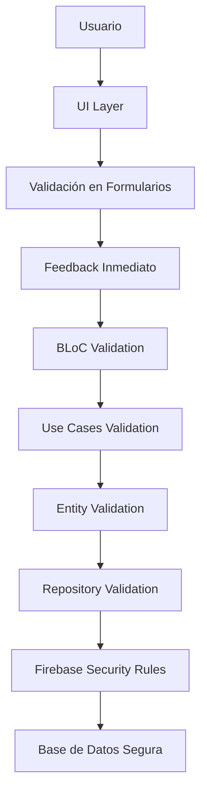

✅ Validación de Datos - Viajero App
🛡️ Mecanismos que Aseguran Integridad y Corrección de la Información
Enfoque: Validación en Múltiples Capas
Técnicas: Validación en UI, Dominio y Base de Datos
Herramientas: Formz, Validadores Custom, Firebase Security Rules

📖 Tabla de Contenidos
🏗️ Arquitectura de Validación

📝 Validación en Formularios UI

🎯 Validación en Capa de Dominio

🔥 Validación en Firebase

🔐 Validación de Autenticación

📍 Validación de Datos Geográficos

⚡ Validación en Tiempo Real

🐛 Manejo de Errores de Validación

🏗️ Arquitectura de Validación
🔄 Estrategia de Validación en Múltiples Capas

